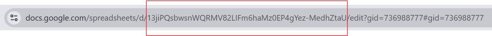

This package is used to download game balance data from a Google Spreadsheet and update local configurations.

### 📦 How to install
1. Require [Git](https://git-scm.com/) for installing package.
2. Open Unity Package Manager
3. Add package via git URL 
```
    https://github.com/vstrucovski/Unity-Spreadsheet-Sync.git
```
OR add directly to manifest
```
"com.strukovski.spreadsheetsync": "https://github.com/vstrucovski/Unity-Spreadsheet-Sync.git"
```

# 🧾 How to use
1. Add the SpreadsheetSyncer component to a scene
2. Set the sheet ID
3. Assign ScriptableObjects that should be updated

**Limitations**:
One 'SpreadsheetSyncer' can fetch data from one Google Spreadsheet

# Prepare
### 1️⃣ Table
The first row is used for data binding. The names should match your target ScriptableObject properties/fields.
All subsequent rows are used for each ScriptableObject separately.


### 2️⃣ Spreadsheet with values
Publish your document to the Web

Where to find your sheet id. Will be used later in code


### 3️⃣ Your ScriptableObject
Tag your ScriptableObject with interface IDataBindable and implement Parse()
```cs
    [CreateAssetMenu(menuName = "Example/UnitData")]
    public class UnitData : ScriptableObject, ICsvBindable
    {
        [field: SerializeField] public string id { get; set; } //first column
        public int health;                                     //second column
        public float attack;                                   //third column

        public void Parse(SpreadsheetLine spreadsheetData)
        {
            DataBinder.Bind(this, spreadsheetData);
        }
    }
```

### 4️⃣ Auto fetching
To automatically populate a group of ScriptableObjects with data from a spreadsheet, extend the ScriptableObjectTypedGroup class, as demonstrated in Example 3. <br>Additionally, ensure the "Is Single Type" checkbox is enabled on the SpreadsheetSyncer component.  
